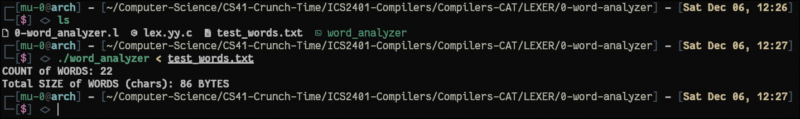

# ics 2401 compiler construction - lexer

## files:
- `0-word_analyzer.l` - counts words and total characters
- `1-abc_case_converter.l` - replaces string "abc" with "ABC"
- `2-recognizer.l` - recognizes select english verbs
- test files: `test_words.txt`, `test_abc.txt`, `test_verbs.txt`
- `Makefile` - for easy compilation

## compile + run executables:
```bash
# method 1: using make - look at file paths first for this otherwise use method 2
sudo pacman -S flex # use the equivalent of your gnu/linux distro; if on windows your bad decision and you have to deal with yourself :)
make          # compile all
make test     # run tests

# method 2: manual compilation
flex 0-word_analyzer.l
gcc lex.yy.c -o word_analyzer -lfl
./word_analyzer < test_words.txt
```
#### word count [example]:


> **NOTE**:  
> - `-lfl` links the flex library: contains default implementations
> - `lex.yy.c`(default generated c code from specification file) gets overwritten w/ each compilation: you can specify output using `-o` option if all your files are in one place(but we have our files intheir own directory directory)