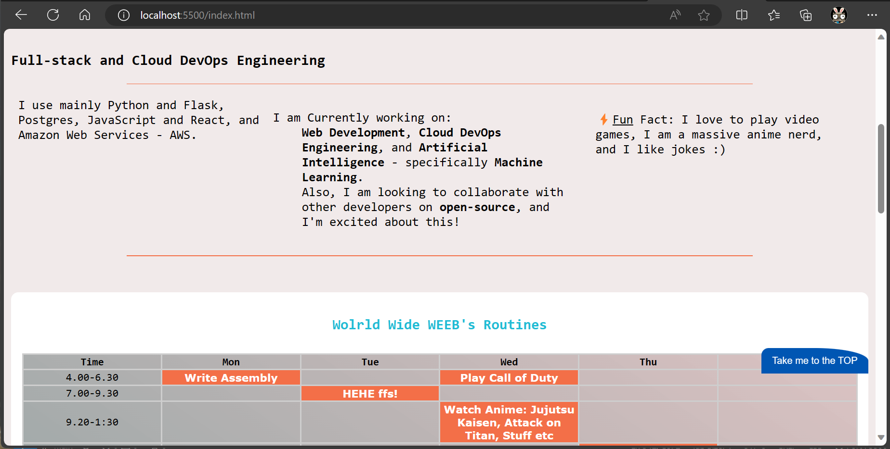
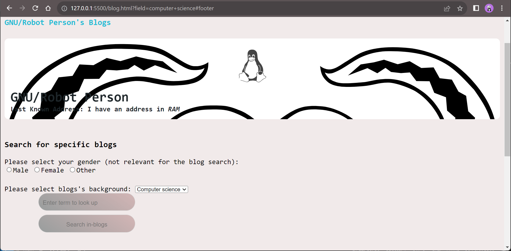
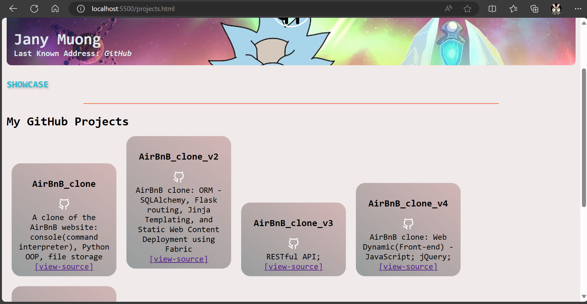
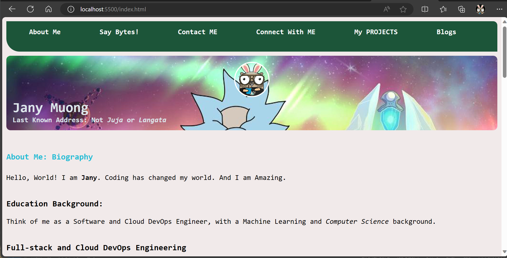

# ICS 2203: INTERNET APPLICATION PROGRAMMING
## SECTION 1: About Me Bio
> INDIVIDUAL WORK: ***Biography/Porfolio-like project*** `HTML`,  `CSS`, `JavaScript` - only.  
> INSTRUCTIONS: Study `CRAP` principles for graphic design and apply them in these exercises.  

1. Using basic `HTML`, `CSS` and `JavaScript` (no framework), make a three page website for a personality of
your choice. Of the three, one should have a form that uses JS to render some information. The index page
should contain a short biography. This page should have:
- A photograph of the person and their last known address.
- A brief biography that includes subsections on education, employment history and any other relevant
information.
- A list of awards and/or distinctions earned by this person.
- A list of this person's contributions to their relevant fields
- A list of relevant references, including any RFPs, standards, papers, or books Authored by this person
that are relevant to the discussion. If possible, this should include links to online materials.

Further:
```
  i. There should be a navigation bar that allows you to jump from page to page in all the 
  pages.
  ii. All the pages should have a consistent look, e.g. same banner, same footer etc.
```

---
### SOLUTIONS
#### `TAKE me to the TOP`
> This is a JavaScript enabled - HTML [`button`](./js/topbutton.js) to get to the top after scrolling for a relatively large segment of the page.

<p align="left">
  
</p>

#### Return `<form>` Element using `JavaScript`;
> This is a JavaScript [`function`](./js/render_form.js) to display a form on a segement of the page: [blog.html](./blog.html)
<p align="left">
  
</p>

#### GitHub Projects Cards
> This is a wepage accessible from the [`index.html`](./index.html) using navigation bar.  
> It uses vanilla [`JavaScript`](./js/projects.js) - no frameworks. It fetches repositories using the [GitHub Repos API](https://docs.github.com/en/rest/repos?apiVersion=2022-11-28#list-repositories-for-a-user), and renders them on a card display.

<p align="left">
  
</p>

---
#### Snaps
The rest of the page rendered looks like this in-browser: 
<p align="left">
  
</p>
