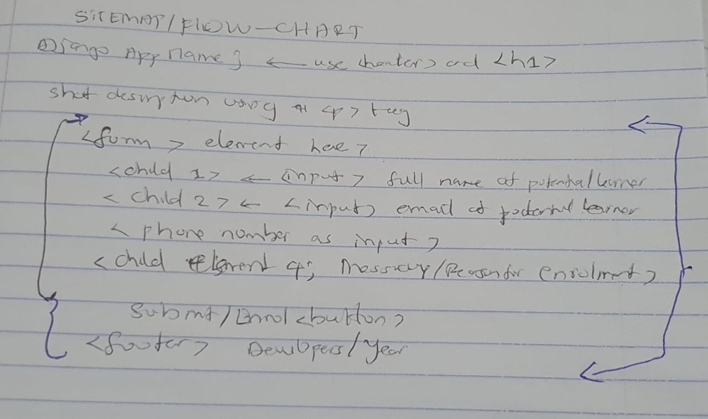
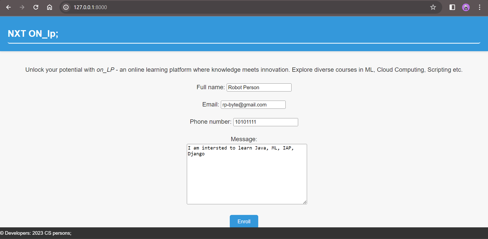
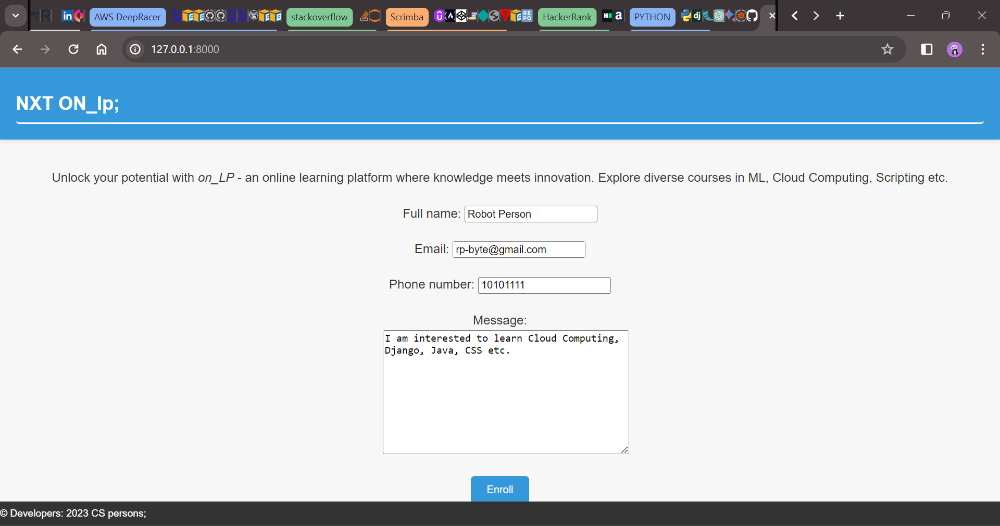

# ICS 2203: INTERNET APPLICATION PROGRAMMING 
## SECTION2

> GROUP WORK ASSIGNMENT
#### Contributors
> This segment lists out the *group members*.
```bash
SCT211-0848/2018 - Jany Muong;
SCT211-0002/2019 - Kimani Geoffrey Chege;
SCT211-0057/2022 - Natasha Wangui Ndung'u  ';
SCT211-0504/2021 - Gatmach Yuol Nyuon;
SCT211-0535/2022 - Akech Dau Atem;
```

>#### INFO:
> This is the Django solutions to part B of the group work. The major Django files e.g models templates and urls are in the [on_lp](./on_lp/) directory. The directory [nxt_lp](./nxt_lp/) refers to the main project dirctory created using `django-admin startproject nxt_lp`.  
> The proposal document can be found here: [proposal.pdf](./on_lp/static/on_lp/img/proposal.pdf)


### `PART B` - Lecturer's Instructions:  
As a team of internet application developers, assume a web project.
1. Guided by the above steps write a proposal document for your project. The title should be the name of the
project. It should contain the following headings;  
a) Introduction–brief description of the project  
b) Target audience–brief description of the expected audience   
c) Goals  
d) Flow chart or sitemap-with explanations  
e) Rough sketches of your ideas for each page.   
f) conclusion  

> Create the site designed in 1. 
>> Include a form for the user to fill (try to implement at least 5 form elements). Use Django to implement the project.

---
### Site Maps;
<p>
  
</p>

### Final Solutions in Snaps
> This segment displays how to start the server in a shell/terminal and how the Django app looks like this when rendered;
<p>
  
  
</p>

### Run Django App In Local Machine;
```bash
git clone https://github.com/janymuong/root-cs_jkuat.git
cd root-cs_jkuat/ics2203_iap/section_2/nxt_lp
python manage.py runserver
```
> #### INFO: 
> view on [http://127.0.0.1:8000/](http://127.0.0.1:8000/)