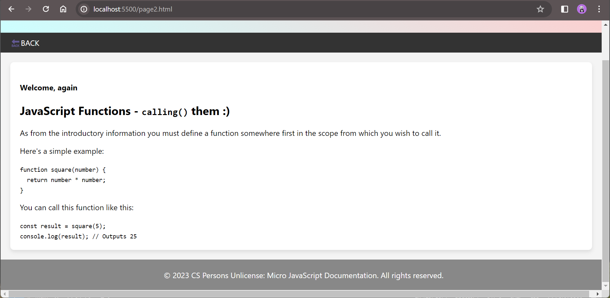

# ICS 2203: INTERNET APPLICATION PROGRAMMING 
## SECTION2:

> GROUP WORK ASSIGNMENT
> Theme Based:  
>> We have decided to work on a little beginner-friendly JavaScript techical documentation.
### `PART A`: Micro-JavaScript Technical Documentation

### Instructions

> Before embarking on a website project you need to set time for planning. planning involves: 

a) Decide on a topic, content or theme.  
b) Define and try to understand the target audience.  
c) Set specific goals you want to accomplish with the design.  
d) Visualize the structure of the website. Create a flowchart.  
e) Select the design principles you will use and begin making some thumbnail sketches. You wil eventually 
want to settle on a sketch for each page. Remember to be consistent throughout.  
f) Create rough sketches of your ideas for each page.  
g) Be able to justify why you have chosen to design your website the way you have.  
In your groups you have already done this part. (Refer to the assignment with the Document and website structure notes)  

Build the site using HTML and CSS only


---
### Solutions
#### Prepping and Sketches/Flowchart
This segement represents the planning in terms of sketching/flowcharts. This is what the plan was;
<p align="center">
  
</p>

#### Rendering in-browser
> The page(s) look(s) like this when rendered;
<p>
  
  
</p>


---
### Contributors
> This segment lists out the *group members*.
```bash
SCT211-0848/2018 - Jany Muong;
SCT211-0002/2019 - Kimani Geoffrey Chege;
SCT211-0057/2022 - Natasha Wangui Ndung'u  ';
SCT211-0504/2021 - Gatmach Yuol Nyuon;
SCT211-0535/2022 - Akech Dau Atem;
```
