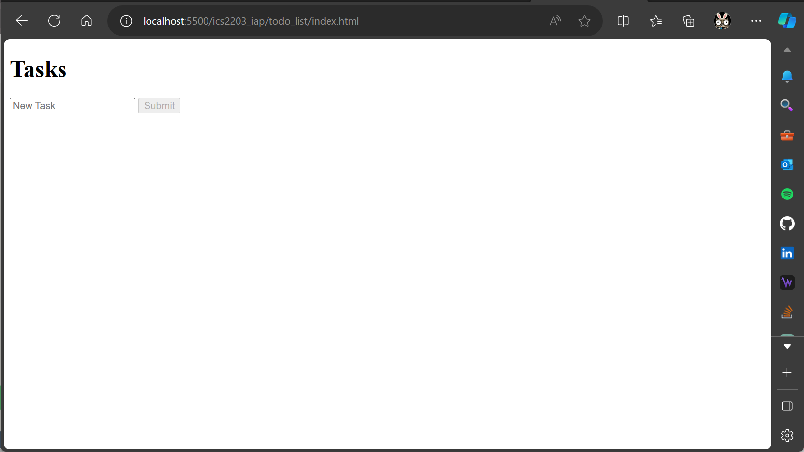
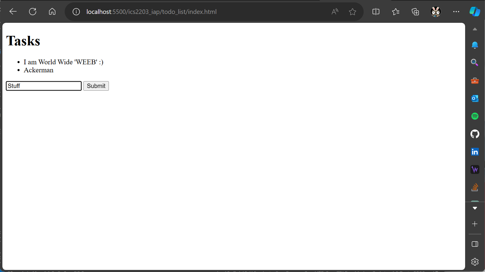

# ICS 2203 - Internet Application Programming

## ToDO List Assignment;
> `JavaScript`  
> `prompt`:  
>> ```bash
TODO list: Assignment –create JS to 
accomplish the following:
• `query` for the `submit` button and input task field once in the beginning and store those two values in the variables submit and newTask.
• `disable` the `submit` button by default. Enable/disable by setting its disabled attribute to false/true.
• Listen for `input` to be typed into the input field
• Listen for submission of `form`
• Find the task the user just submitted
• Create a `list` item for the new task and add the task to it
• Add new element to our unordered list
• At the end of the script, add the line return false. This prevents the default submission of the form which involves either reloading the current page or redirecting to a new one.
Note: create `HTML` elements using the createElement function. Add the elements to the `DOM` using the `append` function  
```

## HTML
> DOM manipulation is done on this markup.
```html
<!DOCTYPE html>
<html lang="en">
    <head>
        <title>Tasks</title>
        <script src="tasks.js"> </script>
    </head>
    <body>
        <h1>Tasks</h1>
        <ul id="tasks"></ul>
        <form action="">
            <input id="task" placeholder="New Task" type="text">
            <input id="submit" type="submit">
        </form>
    </body>
</html>
```

## DOM Rendering
The images below shows how the page looks like in-browser with; `<button>` disabled by default, and the way it looks on accepting input.
<p align="left">
  
  
</p>

---
## Contributors
```bash
SCT211-0848/2018 - Jany Muong;
SCT211-0002/2019 - Kimani Geoffrey Chege;
SCT211-0057/2022 - Natasha Wangui Ndung'u;
SCT211-0081/2022 - IRKE KONZOLO;
Sct211-0062/2022 - Kelvin Mwenda;
```
